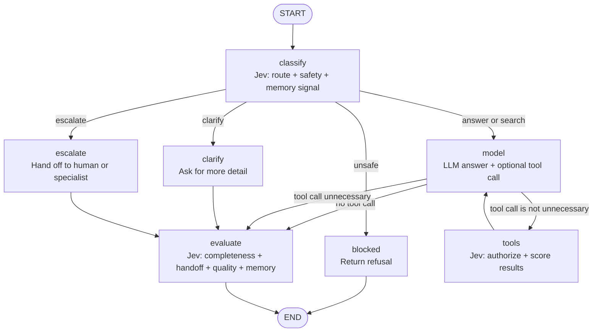

# Analyst LangGraph Agent

This example combines [TypeSafe's jev model](https://docs.typesafe.ai/introduction) with LangGraph to build an analytical assistant that can answer questions, search the web, ask for clarification, or escalate a request.

## What is jev?

Jev is TypeSafe's flagship [System One model](https://docs.typesafe.ai/concepts/system-one). It is designed for fast, structured decisions that software can use directly. Instead of generating text and asking application code to parse it, jev evaluates typed questions against a state and returns typed answers.

TypeSafe provides three primitives:

| Primitive | Use in this agent | Result |
| --- | --- | --- |
| `Choice` | Select a route, tool decision, handoff, or memory action | Choice, probabilities, and confidence |
| `Noul` | Check safety, completeness, authorization, or whether something should be remembered | A value from `0` to `1` |
| `Score` | Judge retrieval and answer quality | Score, probabilities, and confidence |

Multiple questions can be evaluated together against the same state. That makes jev a useful decision layer for applications whose control flow lives in code.

## Agent overview

The agent uses a general-purpose language model for open-ended work and jev for narrow decisions around that work:

1. `classify` evaluates the request's route and safety, then sends the request to the model, a clarification response, an escalation response, or a blocked response.
2. `model` answers from the conversation and can request the `search_web` tool.
3. Before tool execution, jev checks whether the selected tool calls are appropriate and whether each call is safe and authorized.
4. `tools` runs approved searches and uses jev to score the usefulness of each result before returning to the model.
5. `evaluate` scores the final answer for completeness and quality and selects any needed handoff or memory action.

The agent stores these decisions in the `analyst` portion of LangGraph state, alongside the conversation messages. The example records memory decisions but does not persist a memory store.

## From ReAct to JevGraph

A classical [ReAct](https://arxiv.org/abs/2210.03629) loop uses one generative model to repeatedly reason, choose an action, observe the result, and reason again. The control flow is largely implicit in generated text.

This example suggests a different pattern: a **JevGraph**. LangGraph makes the control flow explicit, jev makes fast typed decisions at the graph's boundaries, and the generative model handles open-ended reasoning and response writing. Jev can route the request, gate tool calls, score results, and evaluate the final answer without asking the language model to express each decision as prose.

| ReAct | JevGraph |
| --- | --- |
| Reasoning and action selection happen inside a generative loop | Reasoning, decisions, and actions are separate graph concerns |
| Tool choice is inferred from model output | Tool use is checked with typed jev decisions |
| More work is done by repeated generative calls | Narrow decisions use jev; generation is reserved for synthesis |

## Graph

## Why jev works well with LangGraph

LangGraph is responsible for state, nodes, and control flow. Jev supplies the fast, cheap classification decisions that determine which part of the graph should run. This division keeps each model focused on the job it does best:

- **Lower latency and cost:** use jev for small decisions and reserve the more expensive generative model for synthesis, tool use, and the final response.
- **Direct graph routing:** `Choice` and `Noul` results map naturally to conditional edges and safety thresholds without fragile text parsing.
- **Several checks in one call:** route, safety, and memory questions can be evaluated against one snapshot of state. The same pattern is used for tool authorization and answer evaluation.
- **Observable decisions:** confidence and quality scores are stored in state, making it easier to inspect why the graph took a path.
- **Composable guardrails:** jev can sit before a node, between a model and its tools, or after a response without changing LangGraph's state-machine structure.

The result is a practical split: LangGraph orchestrates the workflow, jev classifies and evaluates the workflow, and the general-purpose model handles language generation.

## Learn more

- [TypeSafe introduction](https://docs.typesafe.ai/introduction)
- [LangGraph](https://langchain-ai.github.io/langgraph/)
